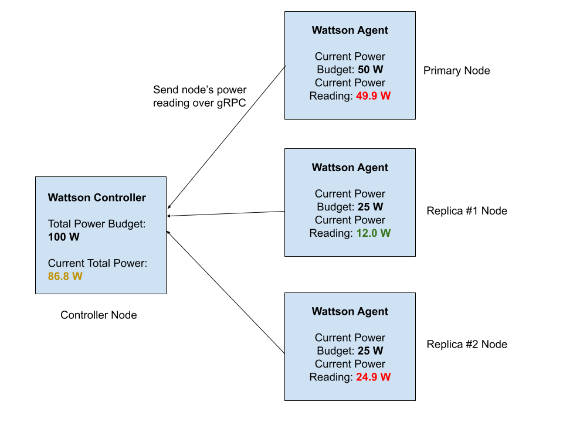

# wattson
Distributed power capping framework to optimize performance of a cluster given a power budget. 
Uses Agent-Controller architecture (similar to [Facebook's Dynamo](https://research.facebook.com/publications/dynamo-facebooks-data-center-wide-power-management-system/)) with multiple lightweight Agent processes running on each server (alongside production workloads) reporting power readings to a dedicated central Controller that makes sure that the total cluster power budget does not exceed the configured power budget at any point of time.

Initially, the focus is on the distributed protocol and creating general interfaces for both Agent and Controller. We also focus on safety, ensuring total power budget is maintained at all times over performance (optimizing power allocation algorithm) for now.
We chose to use RAPL as the power capping mechanism and support Primary-Replica priority, that is, if two nodes are both hitting the limit of their allocated power, the Primary node will be preferred over the Replica.

Wattson differs from FB's Dynamo in that it aims to optimize performance of a cluster, not merely act as "insurance" for power usage. It differs from approaches like [PUPiL](https://dl.acm.org/doi/10.1145/2872362.2872375) in that it aims to optimize performance within a power budget for a cluster of nodes, and can leverage systems like PUPiL to optimize single-node performance given the single node's power allocation. In other words, Wattson is a dynamic, feedback-based power management framework that calculates each node's power allocation at any point of time. Given this calculation, we can use RAPL or PUPiL or any other system to enforce this power limit on the node while extracting maximum performance. 
So, Wattson is closer to [PoDD](https://dl.acm.org/doi/pdf/10.1145/3295500.3356174) in it's aim.

Wattson in a single diagram:

To understand what happens after getting the readings, [click here](docs/README.md) to see Wattson explained in 3 simple diagrams.

Related papers:
* PoDD: power-capping dependent distributed applications - Zhang et al, 2019 - [PDF](https://dl.acm.org/doi/pdf/10.1145/3295500.3356174)
* Dynamo: Facebook’s Data Center-Wide Power Management System - Wu et al, 2016 - [Link](https://research.facebook.com/publications/dynamo-facebooks-data-center-wide-power-management-system/)
* Maximizing Performance Under a Power Cap: A Comparison of Hardware, Software, and Hybrid Techniques - Zhang el al, 2016 - [Link](https://dl.acm.org/doi/10.1145/2872362.2872375)
