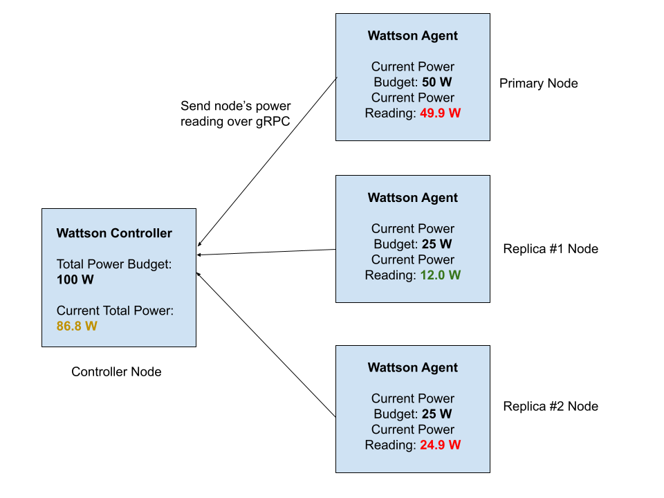
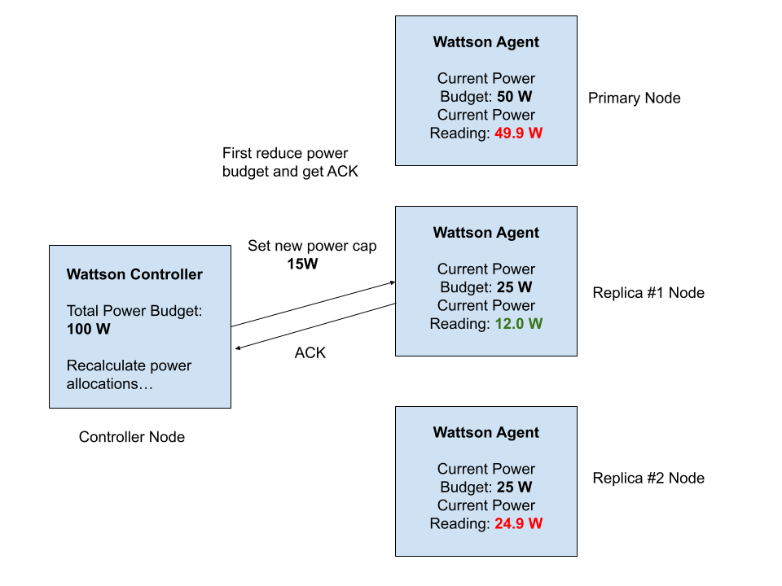
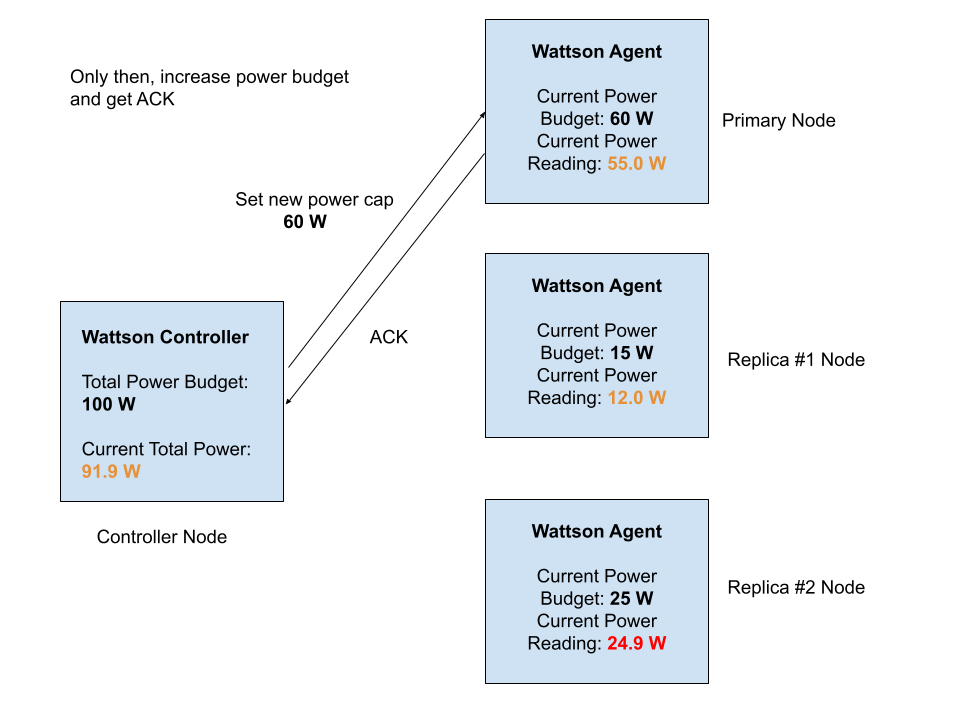

# wattson

Here is Wattson explained in 3 simple diagrams:

1. The Controller is given a total power budget to maintain AT ALL TIMES and periodically gets power readings from multiple Agents. If any power readings are close their allocated budget, it means the node wants more power.

2. We see that the Primary and one Replica #2 node are hitting their budget limit, they need more power. We can take some excess power from Replica #1, which doesn't need it. To ensure we stay within the total budget at all times, we need to decrease Replica #1's budget and get an ACK before increasing any other node's budget. In  other words, the total allocated budget at all times must be 100 W or less.

3. After getting an ACK from Replica #1, we have 10 W of excess power budget to hand out. We prioritize Primary over Replica #2 and increase its budget from 50W to 60W.

